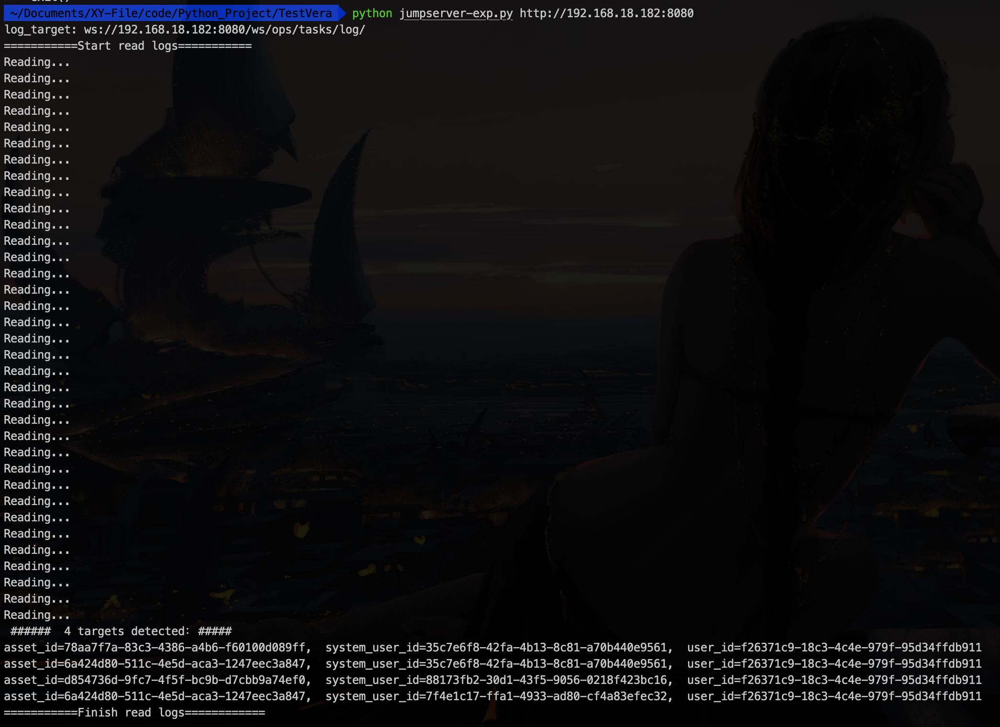
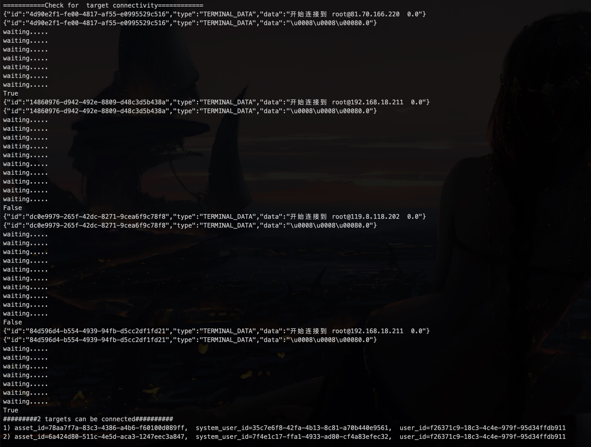
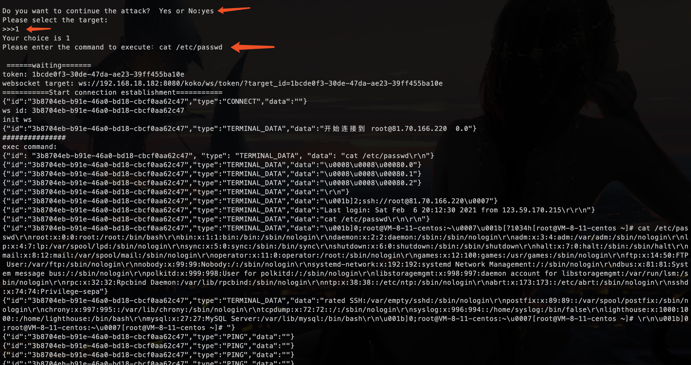

# Jumpserver-EXP
JumpServer远程代码执行漏洞检测利用脚本


## 用法
脚本在python3环境下编写。

运行脚本：

```
python jumpserver-exp.py [address]

如：python jumpserver-exp.py http://192.168.18.182:8080
```
运行过程中根据提示输入选择。


## 功能
1. 读取日志

运行脚本初期，会先读取目标日志文件，默认路径为`/ws/ops/tasks/log/`。若日志路径与默认路径不符，且已知实际路径，请自行修改代码。
从中检测出可能被利用的目标资产，以 <asset_id、system_user_id、user_id> 的格式列出。



2. 检测目标可连接性

针对上一步列出的目标列表，逐个判活，检测可用性，并将可用目标附带编号列出。



3. 执行命令

脚本询问用户，是否选择进一步攻击？输入`yes`继续，输入`no`则结束。
随后询问用户要使用的目标，根据上一步列出的可用目标列表来选择。
继续询问用户，要执行的命令。
参数设定完毕，脚本按预期连接目标并执行命令。


